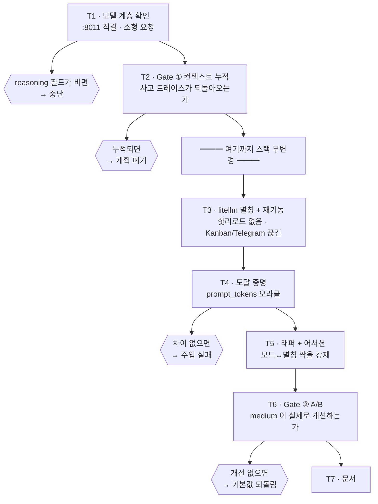

# Plan/Act 배선도 — 그림 설명

> `docs/plan-act-reasoning-design.md`(설계)와 `docs/plan-act-reasoning-implementation.md`(구현 계획)의
> 시각 요약. 소스 확인 `cline/cline` tag `cli-v3.0.53`, 실측 2026-09-01. ※ 2026-09-10:
> `cline-src` 작업 트리는 이후 `cli-v3.0.61` 로 이동했다 — 위 인용을 재확인하려면 워킹
> 트리를 그렙하지 말고 `git show cli-v3.0.53:<path>` 형태로 조회할 것,
> `phase-12/SCOPE-DECISIONS.md` 항목 6.
>
> **2026-09-10 정정.** 아래 상태 배지는 2026-09-01 작성 당시의 것이며 더 이상 유효하지
> 않다. §1 "이 정정이 바꾸는 것" 은 §7 을, 미해결은 §8 을 볼 것. 정정 전 원문은 §9 부록에
> 보존한다.
>
> **상태: 구현됨 (v1.1).** 별칭은 Phase 10, 래퍼는 Phase 11 에서 출하됐다.
> - **게이트 ① (컨텍스트 누적)**: kill 아님. 재생된 사고는 토큰 비용 0(`delta=0`,
>   `prompt_tokens` 46 고정) — 근거·상세는 §6 의 정정된 콜아웃.
> - **게이트 ② (A/B)**: 정확도 개선 없음(arm A 25/30, arm C 25/30, p=0.563) — `keep` 은
>   사람이 사전 등록 규칙의 `revert` 출력을 override 한 결과이며, 개선이 증명됐다는 뜻이
>   아니다. `providers.json` 오염 부작용의 격리(commit `017c65e`)가 override 의 근거다.
>   근거: `phase-11/AB-RESULTS.md` §8·§11.

---

## 1. 두 경로는 코드상 만나지 않는다

Plan/Act 는 **도구 가드**, `--thinking` 은 **추론 설정**. 서로를 참조하지 않는다.

```
        --plan / -p                        --thinking <level>
             │                                     │
             ▼                                     ▼
  createPlanModeCommandGuard          settings.reasoning.effort
  command-guard-extension.ts:39       provider-settings.ts:211 → 268
             │                                     │
             ▼              ╎ 접점 없음 ╎           ▼
        beforeTool()        ╎          ╎      reasoningEffort
  tool.name !== RUN_COMMANDS╎          ╎      compat.ts:429-438
    이면 그냥 통과          ╎          ╎           │
             │              ╎          ╎           ▼
             ▼                            reasoning:{enabled,
     명령 실행만 제한                       effort,budgetTokens}
   사고 방식은 건드리지 않음                    wire 로 나간다
```

**덧붙여** — CLI 3.0.53 에는 모드별 프로바이더 오버라이드가 없다.
`providers.json` 에 `"modes": {}` 가 쓰이지만 스키마에 대응 정의가 없고,
`modeOverride` · `perMode` · `getSettingsForMode` 류도 소스에 없다.

---

## 2. 신호는 첫 층에서 막힌다

두 경로를 이었다 해도 `reasoning_effort` 는 모델에 닿지 못한다.

```
  client   Cline CLI                                   전송
           cline --thinking medium
              │
              ▼
      { … , "reasoning_effort": "medium" }
              │
              ▼
  :4000    litellm                              ██ HTTP 400 ██
           allowed_openai_params 미설정
           drop_params 미설정
              ╳
        ⛔ 여기서 끝. 아래로 내려가지 않는다

  :8011    role-shim            (도달 못 함)
  :8000    mlx_vlm.server       (도달 못 함)
           Qwen3.8-Flash-Next-MLX-oQ4 + MTP
```

litellm 응답 원문:

```
litellm.UnsupportedParamsError: openai does not support parameters:
['reasoning_effort'] … To drop these, set `litellm.drop_params=True`
```

**`cline --thinking <아무 값>` 이 전부 실패한다.** `high` 만의 문제가 아니다.

### 층을 건너뛰면 다르게 나온다

| 경로 | 값 | 결과 | 의미 |
|---|---|---|---|
| litellm `:4000` | `low`·`medium`·`xhigh`·`high` | **400** | litellm 이 막는다 |
| role-shim `:8011` 직결 | `medium` | **200** | 모델은 받는다 |
| role-shim `:8011` 직결 | `high` | **500** | 모델이 거부하는 값 |

VALIDATED.md 의 `low`/`medium`/`xhigh` 정상, `high` → 500 기록은 **`:8000` 직결 기준**이며
그 문서가 명시하고 있다. 두 기록은 모순되지 않는다 — 층이 다를 뿐이다.

---

## 3. 해법 — 통과가 아니라 주입

차단을 뚫는 대신, **Cline 이 아예 보내지 않게** 한다.

```
  ✕ pass-through                      ✓ injection
  ─────────────────────               ─────────────────────────────
  Cline                               Cline
  --thinking medium                   -m flashnext-plan · 플래그 없음
      │  보냄                              │  그대로
      ▼                                    ▼
  litellm                             ╌ reasoning_effort 없음 ╌
  allowed_openai_params 로 해제 필요        │
      ╳  400                               ▼
                                      litellm 별칭
  설정 추가 필요                       litellm_params 가 주입
  Cline wire 형태 캡처 필요                 │  통과
  자동 업데이트로 깨질 수 있음               ▼
                                      + "reasoning_effort":"medium"
                                           │
                                           ▼
                                      모델 :8011 → :8000
                                           ▼  200

                                      Cline 무수정 · 400 을 만나지 않음
                                      모델을 고를 수 있는 모든 표면이 따라옴
```

> 🔴 **`drop_params: true` 를 쓰지 말 것.**
> 파라미터를 **조용히 버려서** 400 만 없앤다. 요청은 200 을 받지만 아무 일도 일어나지 않는다 —
> `models[].contextWindow` 와 `maxTokens` 로 이 프로젝트가 두 번 당한 실패 모드와 정확히 같다.

---

## 4. Act 모드는 만들 것이 없을 수 있다

`enable_thinking` 의 기본값이 이미 `false` 다. v1 전체가 이 상태로 돌았고 agent 93.3% 를 냈다.
**요청한 "act = thinking off" 는 현재 상태 그 자체다.**

| T1-b 결과 | 결정 |
|---|---|
| `enable_thinking:false` 가 litellm 을 통과 | `flashnext-act` 별칭 생성. *"기본값은 버전 간 움직일 수 있지만 고정된 플래그는 아니다"* |
| 통과하지 못함 (Qwen 전용이라 거부) | **별칭을 만들지 않는다.** 통하지 않는 설정을 남겨두는 것이 더 나쁘다 |

---

## 5. 가장 먼저 확인할 이상 징후

`reasoning_effort` 는 시스템 프롬프트 길이를 바꾼다. 그것이 파라미터 도달을 증명하는
오라클이 되지만 — 값의 순서가 직관과 어긋난다.

```
 effort 별 시스템 프롬프트 길이 (VALIDATED.md §4)

 medium         ████████████                     21   ← 미지정보다 짧다 (!)
 미지정/false   █████████████                    23
 low            ████████████████████████████     51
 xhigh / true   ███████████████████████████████  63
```

> ⚠️ **T1-a — 가장 먼저 답해야 할 질문**
>
> `medium`(21) 이 미지정(23)보다 **짧다.** 사고를 켜는데 프롬프트가 짧아진다는 건 앞뒤가 안 맞는다.
> `medium` 이 실제로 `reasoning` 필드를 만드는지 확인하지 않고 진행하면
> **아무 일도 안 하는 설정을 배포**하게 된다.
>
> 그리고 medium 과 미지정은 **2 토큰 차이**라 도달 증명 프로브로 쓰기에 취약하다 —
> 확인은 `low`(51) 나 `xhigh`(63) 로 한다.

---

## 6. 중단 지점이 무위험 구간에 있다

스택을 건드리기 **전에** 계획 폐기 여부가 결정된다.



> **2026-09-10 정정 — K2/K6 의 실제 결과 (다이어그램은 그대로, 주석만 추가).** 이
> 흐름도의 K1/K2/K4/K6 은 **당시 계획이 무엇을 검사하려 했는지**를 보여주는 것으로
> 유효하며, 다시 그리지 않는다. 실제로 발동했는지는 다음과 같다: **K2 는 발동하지
> 않았다** — 사고는 재첨부되지만 토큰 비용이 0이라 kill 조건이 아니었다(§6 콜아웃 참조).
> **K6 도 발동하지 않았다** — A/B 는 실행됐고(T6), 개선은 없었지만 규칙의 기계적 출력
> `revert` 를 사람이 override 해 `keep` 으로 확정했다(개선 증명이 아니라 `providers.json`
> 부작용의 격리가 근거). 즉 두 킬 포인트 모두 "폐기/되돌림"으로 끝나지 않았지만, 그 이유는
> 서로 다르다 — K2 는 조건 자체가 발동 안 함, K6 은 발동 조건(개선 없음)은 참이었으나
> 다른 이유로 override 됨. 근거: `phase-09/GATE-VERDICT.md` §4.2,
> `phase-11/AB-RESULTS.md` §8·§11.

> 🔴 **Gate ① 이 kill condition 인 이유**
>
> v1 이 실측했다 — **실제 에이전트 부하에서 압축이 프루닝하지 않는다.**
> 컨텍스트는 단조 증가한다. 여기에 사고 트레이스까지 누적되면 32K 천장에 더 빨리 부딪히고,
> 압축은 여전히 줄이지 못한다.
>
> **2026-09-10 정정.** 소스 조사는 실제로는 **"누적된다" 쪽을 가리킨다** — Cline 은
> `shouldIncludeReasoningHistory` 가 non-Cerebras 프로바이더 기본값으로 `true` 를 반환해
> 사고 이력을 다음 턴에 다시 붙인다(`git show
> cli-v3.0.53:sdk/packages/llms/src/providers/ai-sdk.ts` 284–289줄). 위 원래 문장이 인용한
> `toGatewayRequestMessages()`/`agentic-compaction.ts:88` 는 재첨부 경로가 **아니었다** —
> 범위를 잘못 짚은 소스 판독이었다. 그런데 **실측으로는 게이트가 통과했다**: 재생된 사고
> 트레이스를 되먹여도 `prompt_tokens` 가 16/16 판정 전부 `delta=0`(고정 46)이다 — 붙긴
> 붙지만 **토큰 비용이 0이라서** 통과했다. "안 붙는다"와 "붙어도 무해하다"는 서로 다른
> 주장이며, 이 문서의 실수는 첫 번째 주장을 했다는 것이다. 근거:
> `phase-09/PRB-04-FINDINGS.md` §3, `phase-09/GATE-VERDICT.md` §4.2.

---

## 관련 문서

| | |
|---|---|
| 설계 | `docs/plan-act-reasoning-design.md` |
| 구현 계획 | `docs/plan-act-reasoning-implementation.md` |
| 압축·컨텍스트 실측 | `docs/32k-compaction-policy.md` |
| 모델 쪽 thinking 제약 | `~/local-llm-settings/VALIDATED.md` §4 |
| 웹 버전 | https://claude.ai/code/artifact/f8847e03-9e2a-413f-acf2-3d8ae56fe140 (※ 2026-09-10: 이 정정 이전 시점의 미러다 — 재발행하지 않았으므로 이 문서와 내용이 다를 수 있다, 위 링크만 보고 판단하지 말 것) |

## 7. 이 정정이 바꾸는 것

| 대상 | 이전 (2026-09-01) | 이후 (2026-09-10) |
| --- | --- | --- |
| 상태 배지 | 계획, 미착수 | 구현됨(v1.1) — 별칭 Phase 10, 래퍼 Phase 11 출하 |
| Gate ① 콜아웃 (§6) | 소스 판독이 재첨부 없음을 시사한다는 취지의 서술(범위를 잘못 짚은 함수 인용) | 소스 판독은 재첨부가 **있다**는 것을 보여준다 — 다만 토큰 비용이 0이라 게이트는 통과 |
| K2/K6 (§6 흐름도 주석) | 흐름도만 존재, 발동 여부 미기재 | K2 미발동(비용 0), K6 도 미발동(개선 없음이나 사람이 override 해 keep) — 다이어그램 자체는 변경 없음 |

## 8. 미해결

- **CFG-05 — 자동 업데이트를 막을 수 없다.** 바이너리가 `3.0.53 → 3.0.60 → 3.0.61` 로
  드리프트했다(`phase-11/OPEN-ITEMS.md`).
- **실제 에이전트 워크로드에서 압축이 여전히 프루닝하지 않는다.** cline-bench 통과 0/4.
- **`--compaction basic` 은 미검증이다.**
- **`providers.json` 격리는 하루가 안 됐다** — "고쳐졌다"가 아니라 "격리됐다, 더 긴 노출을
  기다리는 중"이다.

## 9. 부록 — 정정 전 기록

아래는 2026-09-01 작성 당시 이 문서가 실제로 적고 있던 원문이다. 삭제하지 않고 보존한다 —
상태 배지와 §6 의 Gate ① 콜아웃만 위 본문으로 대체됐다.

<details>
<summary>원문 펼치기</summary>

원래 상태 배지 (2026-09-01):

> `docs/plan-act-reasoning-design.md`(설계)와 `docs/plan-act-reasoning-implementation.md`(구현 계획)의
> 시각 요약. 소스 확인 `cline/cline` tag `cli-v3.0.53`, 실측 2026-09-01.
> **상태: 계획, 미착수.**

원래 Gate ① 콜아웃 (§6, 2026-09-01):

> 🔴 **Gate ① 이 kill condition 인 이유**
>
> v1 이 실측했다 — **실제 에이전트 부하에서 압축이 프루닝하지 않는다.**
> 컨텍스트는 단조 증가한다. 여기에 사고 트레이스까지 누적되면 32K 천장에 더 빨리 부딪히고,
> 압축은 여전히 줄이지 못한다.
>
> 소스 조사는 "누적되지 않는다" 쪽을 가리킨다 — `toGatewayRequestMessages()` 는 `content`
> 배열만 순회하고, `agentic-compaction.ts:88` 의 `reasoningChars` 는 *요약기 자신의* 출력을
> 세는 텔레메트리다. 다만 결정적이지 않아 실측으로 확정한다.

</details>
